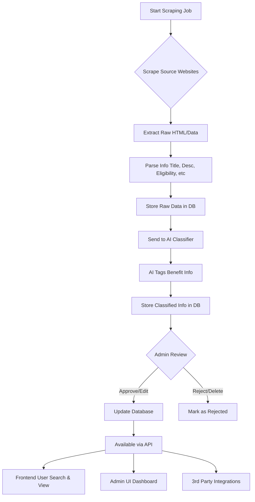

# faida-finder

A web scraping app built with Nestjs that helps Kenyans find out what benefits they're eligible for.

## Project setup

```bash
$ yarn install
```

Node.js
------

This project targets Node.js 20+. Use a Node version manager and set your local environment to Node 20:

```bash
nvm use 20
# or
node --version  # should be >= 20
```

Pre-commit hooks
---------------

This repository uses Husky and lint-staged to run formatting and linting on staged TypeScript files before each commit. To enable the git hooks locally run the installer (this is run automatically after `npm install` because the project defines a `prepare` script):

```bash
npm install
# or, if needed:
npm run prepare
```

When you commit, the pre-commit hook will run Prettier and ESLint on staged `*.ts` files and update the staged files with any fixes. If you need to skip the hooks for a one-off commit, use:

```bash
git commit -m "msg" --no-verify
```

It's recommended to keep these hooks enabled to avoid style/lint regressions being pushed to the repo.

## Compile and run the project

By default the app runs on port 3333 and will try the next available port up to 3342 if needed. You can set a specific port with the PORT environment variable.

```bash
# development (port 3333)
$ npm start

# development on specific port
$ PORT=4000 npm start

# watch mode
$ npm run start:dev

# production mode
$ npm run start:prod
```

## Run tests

```bash
# unit tests
$ yarn run test

# e2e tests
$ yarn run test:e2e

# test coverage
$ yarn run test:cov
```

### ERD Diagram of the app


