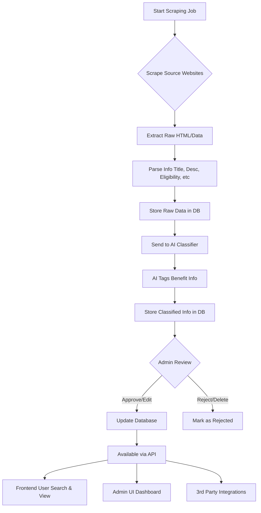

# faida-finder

A web scraping app built with Nestjs that helps Kenyans find out what benefits they're eligible for.

## Project setup

```bash
$ yarn install
```

Node.js
------

This project targets Node.js 20+. Use a Node version manager and set your local environment to Node 20:

```bash
nvm use 20
# or
node --version  # should be >= 20
```

## Compile and run the project

```bash
# development
$ yarn run start

# watch mode
$ yarn run start:dev

# production mode
$ yarn run start:prod
```

## Run tests

```bash
# unit tests
$ yarn run test

# e2e tests
$ yarn run test:e2e

# test coverage
$ yarn run test:cov
```

### ERD Diagram of the app


